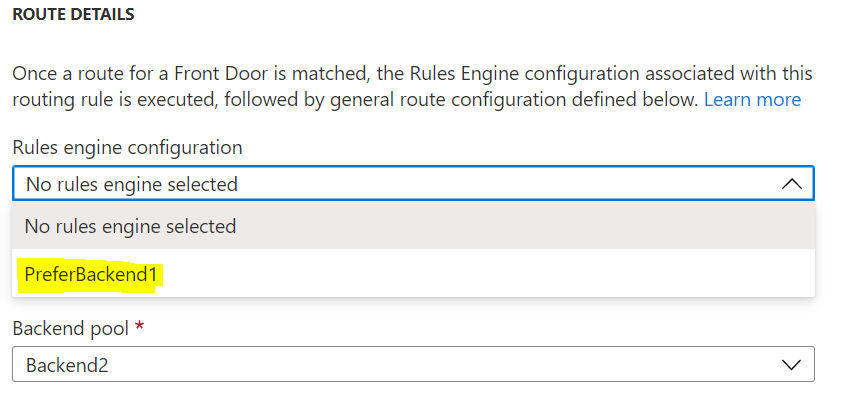

# Azure Front Door Specify Preferred Region

This is a reference deployment of two Web Apps in different regions and [Azure Front Door](https://docs.microsoft.com/en-us/azure/frontdoor/front-door-overview) to route traffic to a preferred Web App region using the [AFD Rules Engine](https://docs.microsoft.com/en-us/azure/frontdoor/front-door-rules-engine). The use case is if you have an operational need to route a portion of production traffic to a specific preferred region. Perhaps you are introducing a new feature and need to test the adoption with a subset of users before rolling out to all users. Another use case is, if you have a stateful application and would like to drain the sessions from an existing legacy Web application instance to new upgraded Web application instance without any disruption to your end users. 

# Demo Components

The following components will be deployed to your resource group.

A rules engine is deployed to the AFD with the following logic:

Essentially, if the request has a header x-pref-backend with value 'Backend1' then the request is routed to Backend pool 'Backend1'. If the header value is something else or the header does not exist, then the rules engine does not modify the routing. The routing will be based on the Default routing rule. In this case it is set to 'Backend2' as shown below:

# Setup Steps

1. Click the Deploy to Azure button to deploy the components to your resource group. Provide appropriate names for the two WebApps and Azure Front Door. For region, select any of the US regions as the Web Apps get deployed to Central US and West US. 
1. Go to the resource group and select the Azure Front Door resource.
1. Under Settings, select Front Door designer.
1. In the Routing Rules section, select the Default rule.

1. In the Route Details section, select the Rules engine configurations dropdown. From the dropdown, select PreferBackend1.

1. Click Update and then Save.

NOTE: The AFD changes take some time to propagate, please wait a few minutes before proceeding to Testing.

# Testing

Use a tool like [Postman](https://www.postman.com/) to submit requests to the Azure Front Door to test the routing based on x-pref-backend request header.

1. Launch Postman tool, and type in the URL of the Azure Fron Door to send a Get request. 
1. Notice the response back from the AFD. It should be the AppName2 you specified during deployment.

1. Add in the request header x-pref-backend and set the value to Backend1. Submit the request.
1. Notice the response back from the AFD. It should be the AppName1 you specified during deployment.

1. Toggle the x-pref-backend header on and off a few times to make sure the backend selected changes based on the header value.

By adding in the x-pref-backend header to the request, we are able to route the traffic to the preferred backend configured in the AFD.